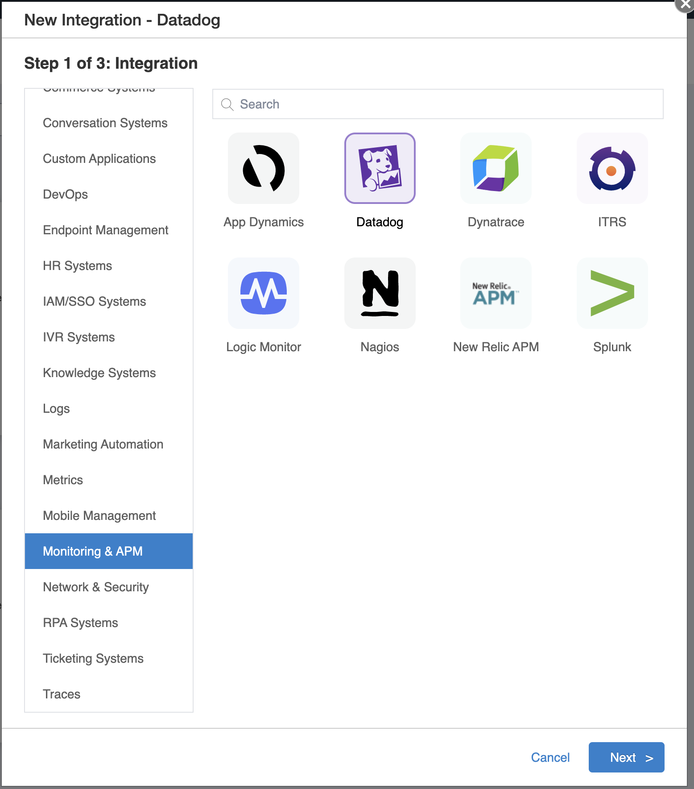
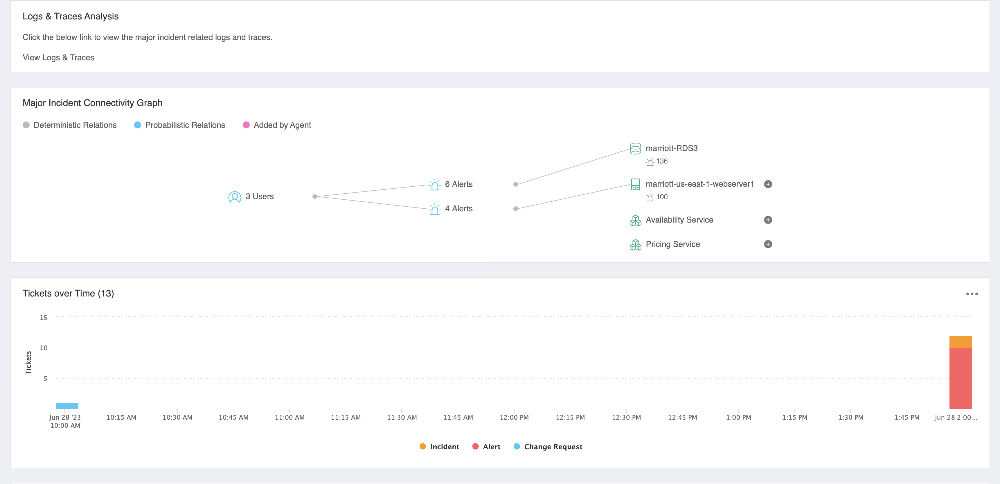
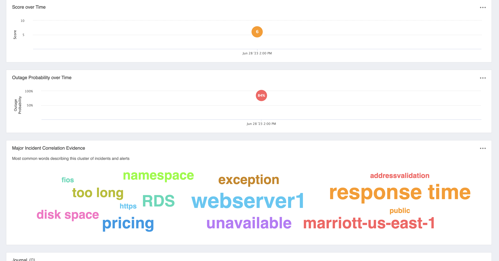

# Agent Check: Aisera

## Overview

 [Aisera's][1] domain-agnostic [AiOps][2] platform identifies complex behaviors and patterns while analyzing correlations and causality on alerts and incidents across applications, services, and systems. 
These advanced capabilities enable accurate prediction of outages and major incidents (MIs) while automating the task to find the root cause and executing runbooks for auto-remediation.

The [Aisera's][1] integration enables you to ingest your Datadog alerts/metrics into Aisera.  Along with other historical and real-time data across your technology stack, Aisera [AiOps][2] automatically predicts major incidents and delivers proactive notifications in a conversational manner.
## Setup

To set up this integration, please [Contact Us][1] for an Aisera account.
You'll also need Datadog API and Application keys.
### Configuration

1. Create a Datadog API key.
2. Create a Datadog Application key.
3. Create a Datadog Integration with  Datadog API and Application keys to the Aisera Datadog Integration.
   1. Go to the Settings > Integration.
   2. Click on New Integration.
   3. In the search bar select "Datadog".
      
   4. Provide Name, API Keys and Application Keys and click Ok.
      
4. Now as we have created an integration, We will create a Data Source for this integration.
   1. Go to Settings > Data Sources > New Data Source
   2. In the search bar select integration in the previous step.
   3. Provide a Name and Scheduler on which the integration should run.
   4. Select function as Alert Learning.
      
      
5. Run the data source , you can also choose to run this datasource based on a scheduler.
6. Once the alerts have been ingested, Aisera AiOps piplelines will run.
7. AiOps pipelines will generate major incidents/clusters based on the category and severioty of incidents recieved.
   1. Each major incident contains the following main components.
      1. Title : A brief info about the major incident 
      2. Status : Open/Close.  
      3. Cluster : Aisera generated cluster to which this major incident belongs to. 
      4. Outage Probability: Outage Probablity for this major incident.
      5. Impacted Business Services.
      6. Impacted Systems (Any Virtual Machine/Pod impacted)
      7. Impacted Storage (Any DB/Storage impacted)
      8. Impacted Users
      9. Incidents (Any Incident from ticketing systems which caused this major incident)
      10. Alerts (Datadog alerts/logs part of this major incident)
      11. Change Request (Any change request which caused this major incident)
      12. A timeline of the incident/alerts corelation.
      13. Root cause : A root cause generated by Aisera LLM model.
      14. Causal Graphs : Graph of business services
      15. Logs and Trance Analysis.
      16. Major Incident Connectivity Graph: A visual representation of how users are impacted by specific alerts/services/infrastructure.
      17. Score Over time : AMI scores overtime.
      18. Outage Probability over time.
      19. Major Incident Correlation Evidence
          
          
          
          
8. Once Aisera detects a major incident ,
   1. it will notify to the designated persona on the channel on their choice.
   2. Aisera will create an incident on Datadog for Datadog Admins to have a visibility of the 
9. We can also put Approvals in place so that before we approvals before any remediation step can run.
10. Aisera can also run any remediation task (Any API call/ Shell/Python/Powershell script/ Terraform manifests etc..) leveraging the No-code platform it provide.

## Data Collection
1. One you run the datasource, Aisera will collect the metrices from datadog.

### Metrics

Aisera can also collect the metrics and run AiOps pipeline on them.

### Service Checks

Aisera does not include any service checks.

### Events

Aisera does not include any events.

## Troubleshooting

Need help? Contact [support@aisera.com](mailto:support@aisera.com).

[1]: https://aisera.com
[2]: https://aisera.com/products/aiops/
[3]: https://docs.datadoghq.com/account_management/api-app-keys/#application-keys
[4]: https://poc0.login.aisera.cloud/#YWlzZXJhLmV4dGVybmFsU3lzdGVtcy5leHRlcm5hbFN5c3RlbXNWaWV3
[5]: https://aisera.com/contact/
